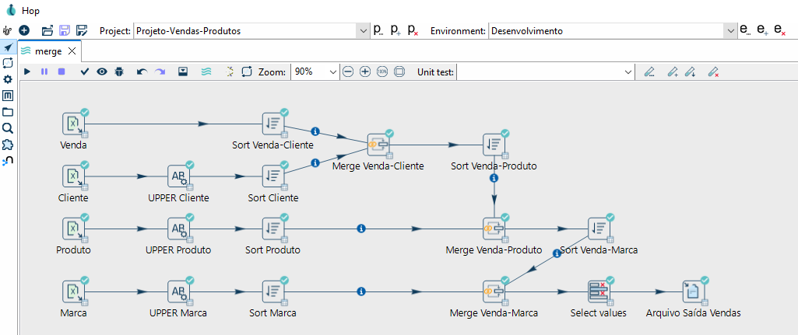

# 🛠️ Projeto ETL com Apache Hop


Este projeto foi desenvolvido como parte dos aprendizados adquiridos no curso **"Super Academia Engenharia de Dados - 9 cursos em 1"**, na plataforma **[Udemy](https://www.udemy.com/)**, ministrado pelo mestre **[Grimaldo Oliveira](https://www.linkedin.com/in/grimaldo/)**.

<br>


## 📌 Objetivo

O objetivo deste projeto é demonstrar a construção de um pipeline de ETL (Extract, Transform, Load) utilizando o Apache Hop, processando dados de vendas, clientes, produtos e marcas de forma automatizada. O fluxo simula um processo de integração e padronização de dados para geração de um arquivo consolidado de vendas.

<br>


## 🧰 Ferramentas e Tecnologias Utilizadas

- **Apache Hop**: Plataforma visual para orquestração de dados e ETL.
- **Java**: Linguagem base do Apache Hop.
- **Arquivos Excel (.xlsx)**: Utilizados como entrada de dados.
- **GitHub**: Para versionamento e colaboração.

<br>


## 🔌 Plugins Utilizados

- **Excel Input**: Leitura de arquivos CSV de entrada (`venda.csv`, `cliente.csv`, `produto.csv`, `marca.csv`).
- **Modified Java Script Value** ou **Set Fields (UPPER)**: Conversão de textos para caixa alta nos campos de cliente, produto e marca.
- **Sort Rows**: Ordenação dos dados para permitir o uso do `Merge Join`.
- **Merge Join**: Junção dos dados relacionando vendas com clientes, produtos e marcas.
- **Select Values**: Seleção e possível renomeação dos campos finais.
- **Text File Output (.txt)**: Geração do arquivo de saída consolidado.

<br>


## 🔄 Visão Geral do Pipeline

Abaixo, o diagrama completo do pipeline criado com o Apache Hop:

<p align="center">
  
</p>

<br>


## 🔍 Etapas do Pipeline

### 1. **Leitura dos Dados**
- Leitura dos arquivos Excel de vendas, clientes, produtos e marcas.
  
### 2. **Padronização**
- Transformação dos nomes de `cliente`, `produto` e `marca` para caixa alta (UPPER) para garantir consistência.

### 3. **Ordenação**
- Cada dataset é ordenado para garantir que os `Merge Join` funcionem corretamente.

### 4. **Integração dos Dados**
- As vendas são relacionadas com os clientes, depois com os produtos e, por fim, com as marcas utilizando o `Merge Join`.

### 5. **Seleção Final e Exportação**
- Seleção dos campos relevantes com `Select Values`.
- Geração de um arquivo de texto (.txt) com os dados de vendas enriquecidos.

<br>


## 📁 Estrutura de Pastas

```plaintext
project-apache-hop-sales-products-etl/
├── assets/
│   └── img/
│       └── diagrama_pipeline_completo.PNG
├── hop-config/
│   └── project/
│       └── venda-produtos/
│           ├── input/
│           ├── output/
│           ├── metadata/
│           └── pipelines/
├── .gitignore
├── README.md
```

<br>


## 🚀 Como Executar

1. Clone o repositório:
   ```bash
   git clone https://github.com/MarcosWinther/project-apache-hop-sales-products-etl
   ```
2. Abra o projeto no Apache Hop.
3. Acesse o pipeline `merge.hpl` no diretório `pipelines`.
4. Execute o pipeline e verifique o arquivo de saída gerado em `output`.

<br>


## 👨‍💻 Expert

<p>
    
    <p>&nbsp&nbsp&nbspMarcos Winther<br>
    &nbsp&nbsp&nbsp
    <a href="https://github.com/MarcosWinther">
    GitHub</a>&nbsp;|&nbsp;
    <a href="https://www.linkedin.com/in/marcoswinthersilva/">LinkedIn</a>
    </p>
</p>
<br/><br/>

---

⌨️ com 💜 por [Marcos Winther](https://github.com/MarcosWinther)